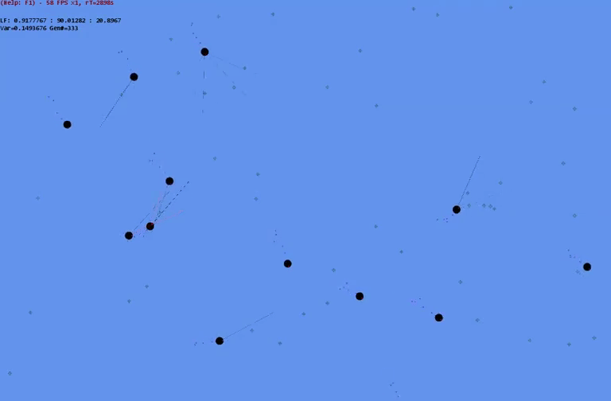

# GeneticNeuralNet-Creatures

Tiny round creatures search for food in a 2D world. Their brain is an artificial neural network consisting of (hyperbolic tangent) **perceptrons**. It takes color vision from a few eyes as input and uses that to control rotation and speed through the world.

Some tire themselves out and starve, others are attacked and eaten, most are just too dumb properly move anywhere. Survival of the least-worse: **natural selection**!

The creatures are assigned a fitness score based on their survival performance, then their genes (the 'weights' from the neural net) are fed trough an implementation of the **genetic algorithm**.

#### Tech
- MonoGame 3.5 (DirectX)
- C# 6